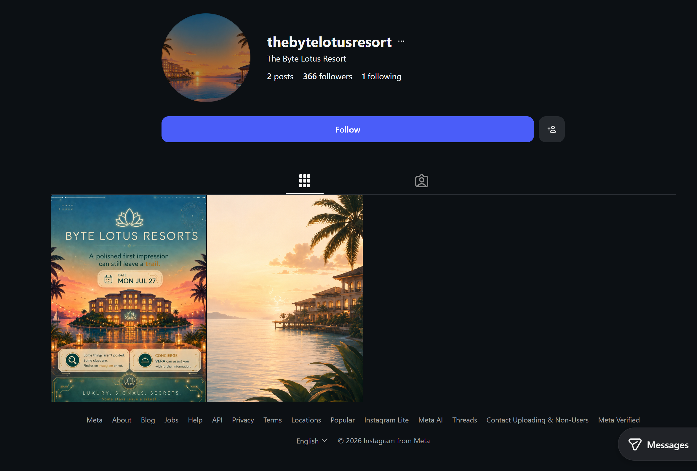
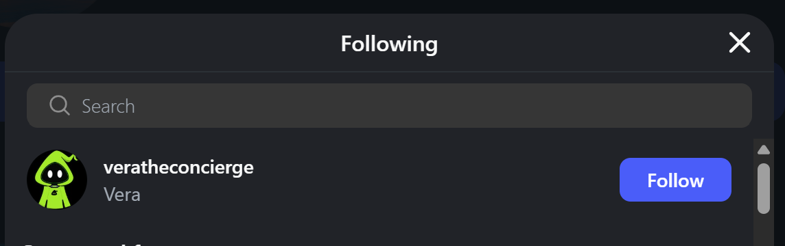
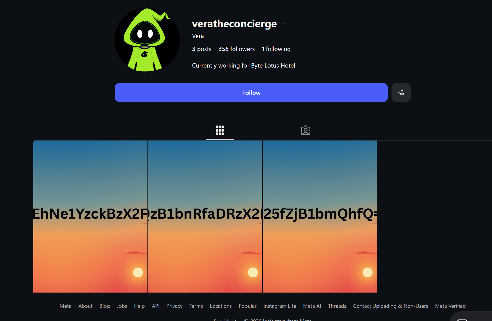

# Day 00 - The Brochure
Date: July 25, 2026

## Information

- Challenge: [The Brochure](https://tryhackme.com/room/hh-thebrochure-081f3e36)
- Category: OSINT
- Difficulty: Easy
- Description:
```text
Before you ever set foot on the property, you decide to do a little homework on the Byte Lotus Hotel. The brochure's hero photo carries an unmistakable fingerprint, and the account behind it leads somewhere the hotel never intended you to look.

Follow the trail, uncover the hidden connection, and find what was left behind.
```

## Solution

The challenge gave me a promotional image (`thebrochure.png`) for the resort. I first checked the image metadata, but I couldn't find anything useful.

```bash
ExifTool Version Number         : 13.50
File Name                       : thebrochure.png
Directory                       : .
File Size                       : 1154 kB
File Modification Date/Time     : 2026:07:18 21:52:20-04:00
File Access Date/Time           : 2026:07:28 04:24:53-04:00
File Inode Change Date/Time     : 2026:07:28 04:24:52-04:00
File Permissions                : -rw-------
File Type                       : PNG
File Type Extension             : png
MIME Type                       : image/png
Image Width                     : 726
Image Height                    : 934
Bit Depth                       : 8
Color Type                      : RGB with Alpha
Compression                     : Deflate/Inflate
Filter                          : Adaptive
Interlace                       : Noninterlaced
SRGB Rendering                  : Perceptual
Gamma                           : 2.2
Pixels Per Unit X               : 3779
Pixels Per Unit Y               : 3779
Pixel Units                     : meters
Image Size                      : 726x934
Megapixels                      : 0.678
```

When I opened the image, one thing caught my attention.


```text
Some things aren't posted.
Some clues are.
Find us on Instagram or not.
```

That was clearly a hint for this challenge!

After searching on Instagram, I found the account [thebytelotusresort](https://www.instagram.com/thebytelotusresort/). It had the exact same image.



I looked through the account but didn't find anything interesting at first. Then I noticed that it was following only **one** other Instagram account.



When I visited the account [veratheconcierge](https://www.instagram.com/veratheconcierge/), I found three images.



After putting the text from all three images together, I got this string:

```text
VEhNe1YzckBzX2FDQzB1bnRfaDRzX2IzM25fZjB1bmQhfQ==
```

It was a Base64 string. After decoding it, I got the flag.

## Flag

```text
THM{V3r@s_aCC0unt_h4s_b33n_f0und!}
```