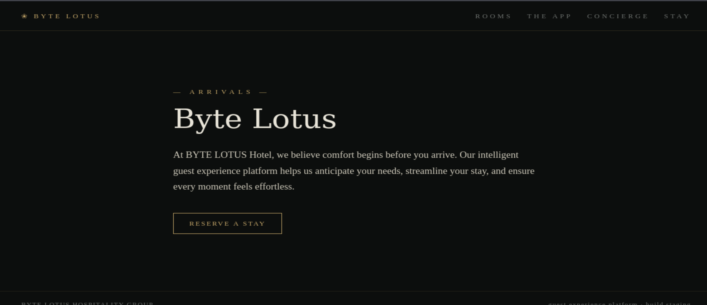
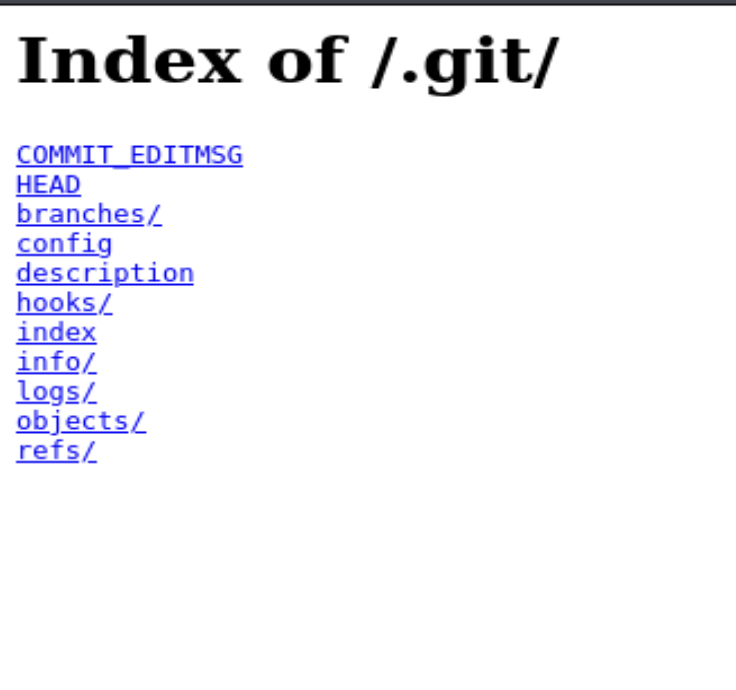

# Day 02 - The Concierge Knows Too Much
Date: July 28, 2026

## Information

- Challenge: [Room 404](https://tryhackme.com/room/hh-room404-804573bf)
- Category: Web
- Difficulty: Easy
- Description:
```text
He booked the quiet room. It's not on the floor plan, not in the brochure, not on any door. But port 8080 is wide open, and the rooms it never lists are the ones worth finding.

Welcome to the Byte Lotus, where the WiFi is open, the app is free, and the concierge already knows your coffee order. You spend these first days as a guest who simply notices things — a room that isn't on the floor plan, packets that leave every night at the same hour, a profile assembled from two breakfasts and a livestream.

The Byte Lotus guest-experience platform went live in a hurry, and the night-shift developer shipped more than the website.
```

## Solution

When I first accessed the website, I looked around but didn't find anything interesting.



So, I decided to look for hidden directories. To do that, I used `gobuster`.

```bash
gobuster dir -u "http://<MACHINE_IP>:8080/" -w /usr/share/wordlists/seclists/Discovery/Web-Content/common.txt
```

While scanning, `gobuster` found that the `.git` directory was publicly accessible (HTTP status code `200`).

```text
.git                 (Status: 200) [Size: 437]
.git/config          (Status: 200) [Size: 92]
.git/HEAD            (Status: 200) [Size: 21]
.git/index           (Status: 200) [Size: 289]
.git/logs/           (Status: 200) [Size: 165]
```

In web application security, exposing the `.git` directory is a serious security issue because an attacker may be able to download the application's source code, including configuration files that could contain sensitive information.



Next, I used `git-dumper` to download the entire Git repository. After the dump was complete, I found the following files:

```text
app.js
index.html
README.md
```

After reading the `README.md` file, I found the flag.

## Flag

```text
THM{byt3_l0tus_n3v3r_f0rg3ts}
```