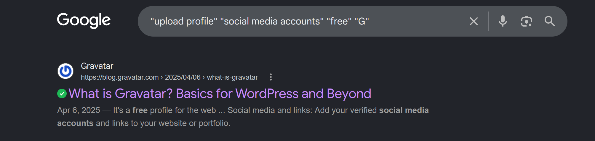
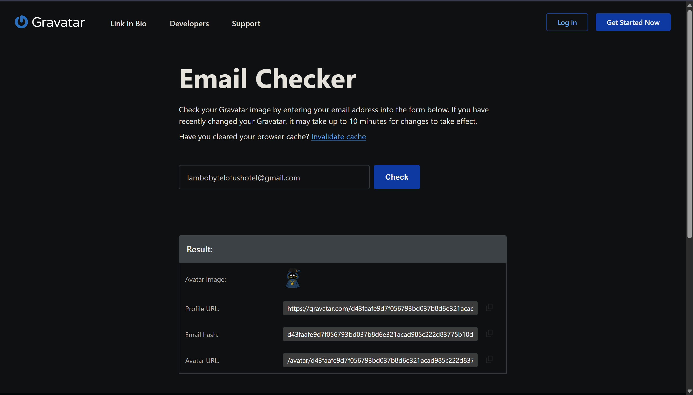
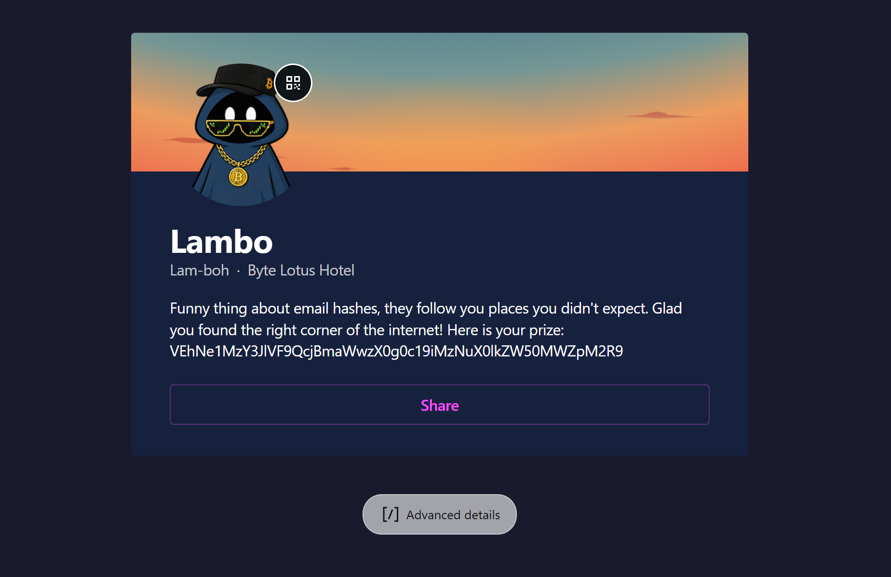

# Overheard at Breakfast

Date: August 01, 2026

## Information

- Challenge: [Overheard at Breakfast](https://tryhackme.com/room/hh-overheardatbreakfast-6f01793c)
- Category: OSINT
- Difficulty: Easy
- Description:

```text
The breakfast terrace is loud this morning, clinking cutlery, espresso machines, the usual chatter. One guest couldn't help but linger at a nearby table, seeing more of a conversation than they were meant to.

When the table's occupant stepped away for a refill, they seized the moment and grabbed a screenshot before it could disappear. Somewhere in that conversation is enough to track down an account nobody was supposed to find.
```

## Solution

The challenge gives me a screenshot of a short conversation between `Lambo!` and `Ponzi`.


Based on the conversation, my goal is to find the tool that `Lambo!` mentioned and then find his profile.

From the conversation, I can collect the following information about the tool:

```text
Free tool
upload profile
link other media accounts
start with letter "G"
Lambo!'s email: lambobytelotushotel@gmail.com
```

Using these clues, I searched with the following Google Dork:

```text
"upload profile" "social media accounts" "free" "G"
```



The first result is [Gravatar](https://gravatar.com/).

After exploring the website, I found its [Email Checker](https://gravatar.com/site/check) feature.

Using `Lambo!`'s email address, I got his profile URL.



I opened his profile and found what I was looking for.



A Base64 string:

```text
VEhNe1MzY3JlVF9QcjBmaWwzX0g0c19iMzNuX0lkZW50MWZpM2R9
```

After decoding it, I got the flag.

## Flag

```text
THM{S3creT_Pr0fil3_H4s_b33n_Ident1fi3d}
```