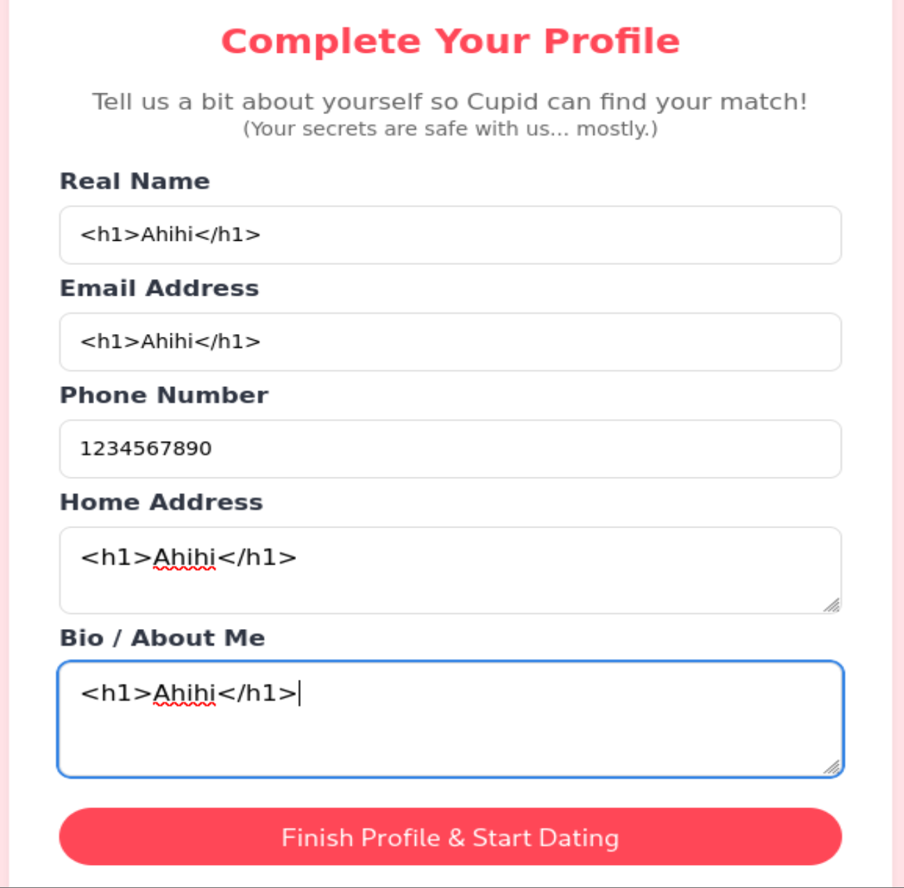
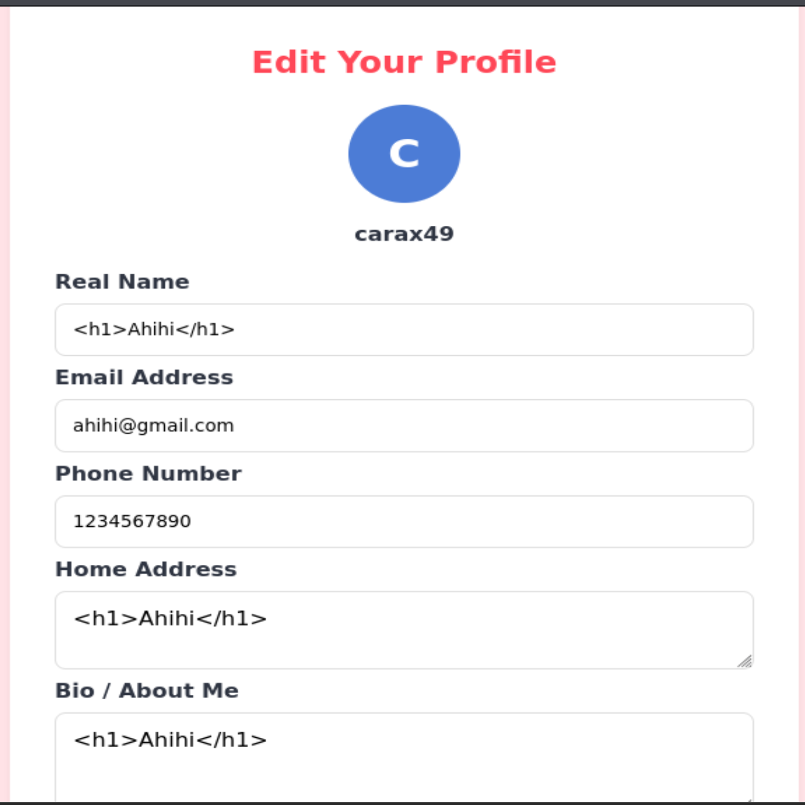
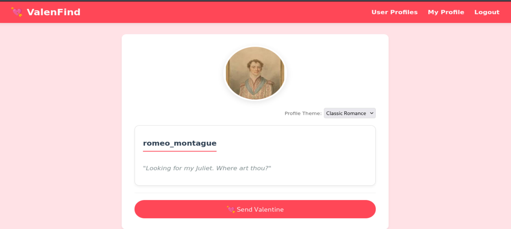
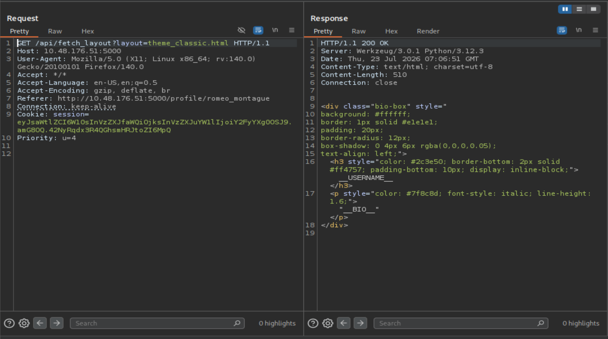
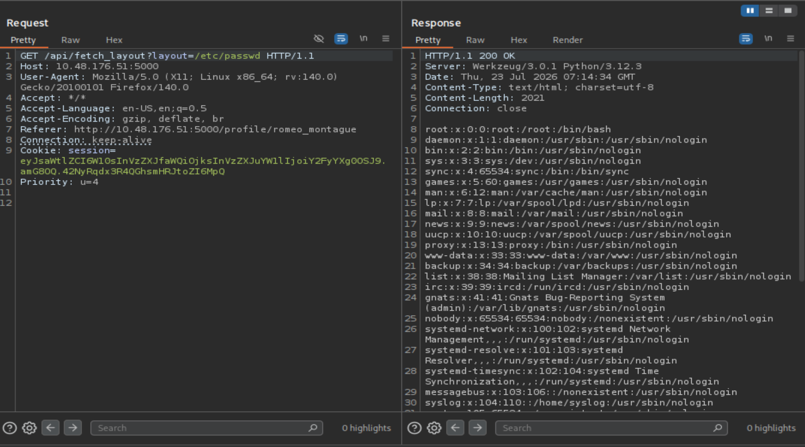
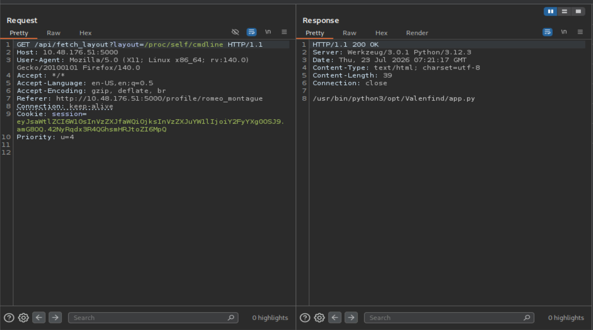
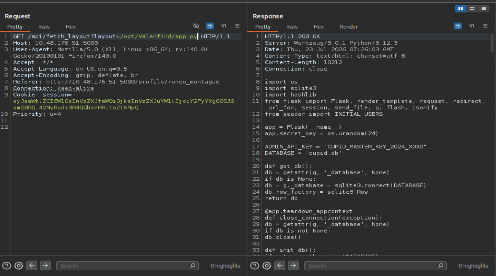
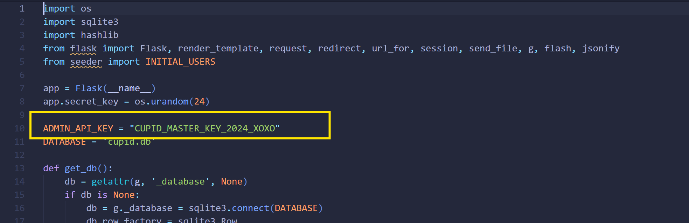
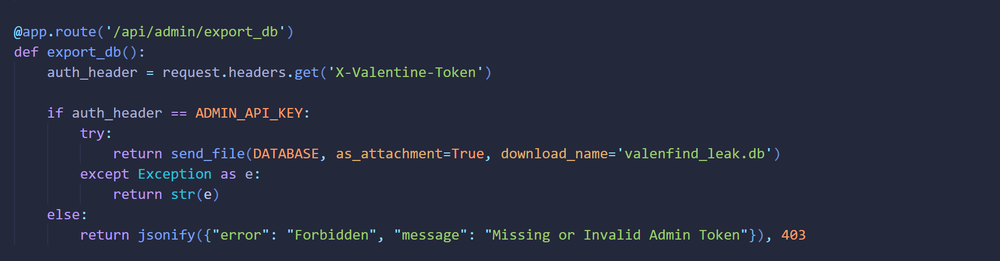
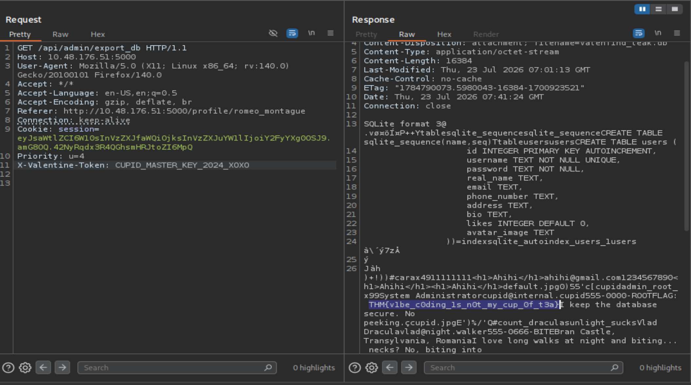

# Valenfind

## Information

- Lab: [Valenfind](https://tryhackme.com/room/lafb2026e10)
- Catagory: Web
- Difficulty: Medium
- Description:
```text
My Dearest Hacker,

There’s this new dating app called “Valenfind” that just popped up out of nowhere. I hear the creator only learned to code this year; surely this must be vibe-coded. Can you exploit it?

You can access it here: http://MACHINE_IP:5000
```

## Solution

Truy cập vào trang web và đăng kí một tài khoản, đến bước hoàn thiện profile, tôi thử với payload `<h1>Ahihi</h1>` để kiểm tra xem web có bị `HTML Injection` không



Trang web có vẻ không bị `HTML Injection`



Quay lại với User Profile, tôi thử xem một profile bất kì đồng thời cho request đi qua Burpsuite



Tôi để ý đến traffic sau



Ta có thể thấy phần query parameter sau rất đáng để thử
```http
?layout=theme_classic.html
```

Tôi đưa request sang Burp Repeater và thử với payload:

```http
?layout=/etc/passwd
```



Rất tuyệt vời, như vậy ta đã xác định trang web có tồn tại `Path Traversal`

Và dựa vào request trả về, ta biết được rằng backend dùng Python, rất có thể là Flask

Tiếp đến tôi lợi dụng lỗ hổng trên để xem process đang xử lí hiện tại

```http
?layout=/proc/self/cmdline
```



Và tuyệt vời, ta có kết quả trong response

```http
/usr/bin/python3/opt/Valenfind/app.py
```

Tôi sẽ tiếp tục khai thác với
```http
/opt/Valenfind/app.py
```



Và như mọng đợi, tôi có được source code của app.py

Trong source code này, tôi có thể thấy một số thông tin vô cùng giá trị



```text
ADMIN_API_KEY = "CUPID_MASTER_KEY_2024_XOXO"
```



Có endpoint `/api/admin/export_db` và header `X-Valentine-Token`

Từ những thông tin trên, tôi sẽ truy cập vào endpoint đó với API key của admin



## Flag

```text
THM{v1be_c0ding_1s_n0t_my_cup_0f_t3a}
```